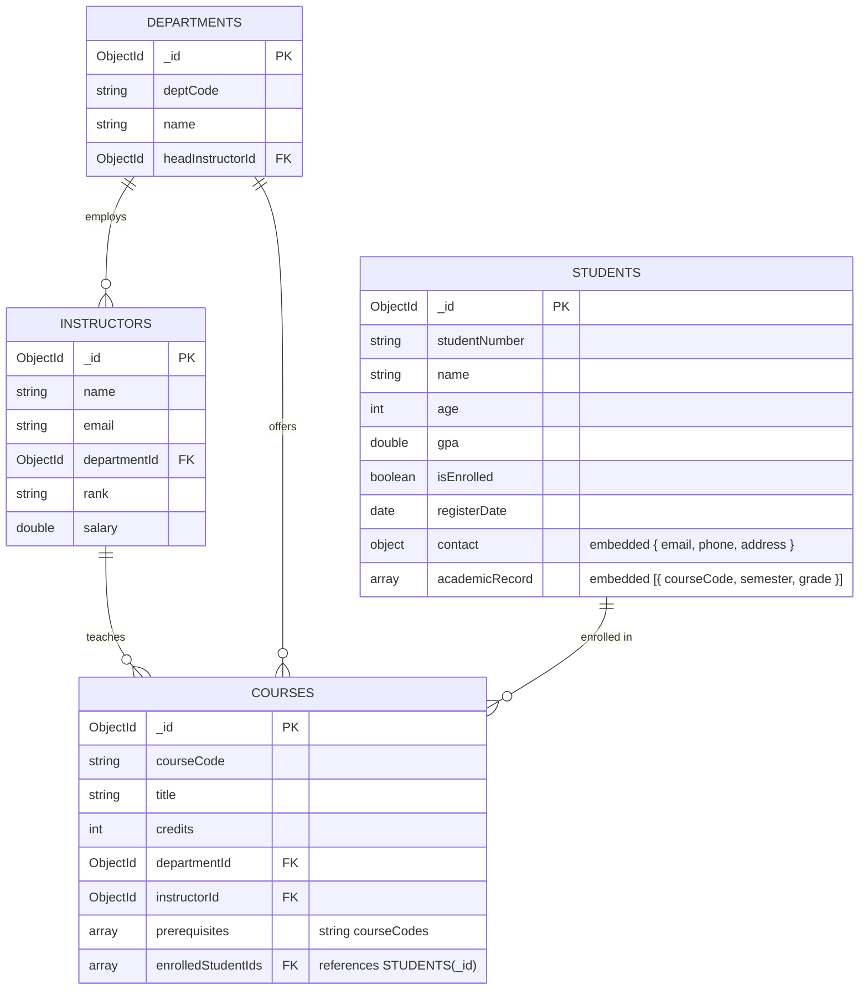

```mermaid
erDiagram
    DEPARTMENTS {
        ObjectId _id PK
        string deptCode
        string name
        ObjectId headInstructorId FK
    }

    INSTRUCTORS {
        ObjectId _id PK
        string name
        string email
        ObjectId departmentId FK
        string rank
        double salary
    }

    STUDENTS {
        ObjectId _id PK
        string studentNumber
        string name
        int age
        double gpa
        boolean isEnrolled
        date registerDate
        object contact "embedded { email, phone, address }"
        array academicRecord "embedded [{ courseCode, semester, grade }]"
    }

    COURSES {
        ObjectId _id PK
        string courseCode
        string title
        int credits
        ObjectId departmentId FK
        ObjectId instructorId FK
        array prerequisites "string courseCodes"
        array enrolledStudentIds FK "references STUDENTS(_id)"
    }

    DEPARTMENTS ||--o{ INSTRUCTORS : "employs"
    INSTRUCTORS ||--o{ COURSES : "teaches"
    DEPARTMENTS ||--o{ COURSES : "offers"
    STUDENTS ||--o{ COURSES : "enrolled in"

```
