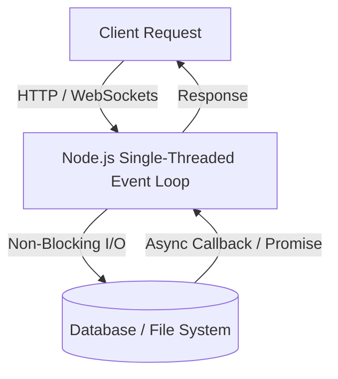
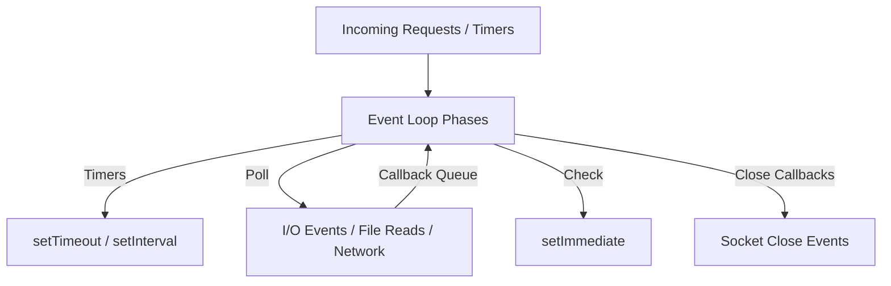
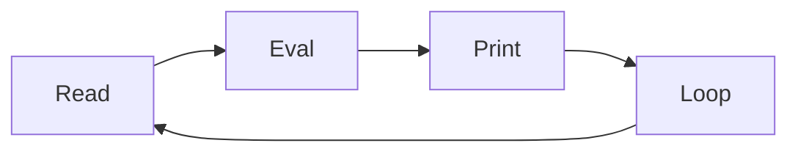
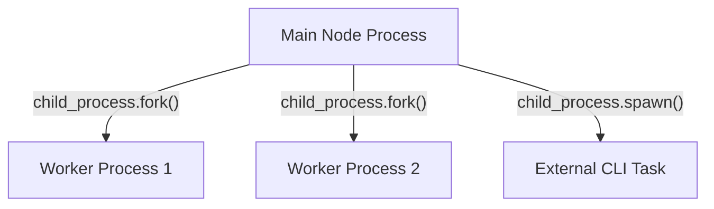

```mermaid
graph TD
    A[Client Request] -->|HTTP / WebSockets| B[Node.js Single-Threaded Event Loop]
    B -->|Non-Blocking I/O| C[(Database / File System)]
    C -->|Async Callback / Promise| B
    B -->|Response| A
```

```mermaid
graph TD
    A[Incoming Requests / Timers] --> B[Event Loop Phases]
    B -->|Timers| C[setTimeout / setInterval]
    B -->|Poll| D[I/O Events / File Reads / Network]
    B -->|Check| E[setImmediate]
    B -->|Close Callbacks| F[Socket Close Events]
    D -->|Callback Queue| B

```

```mermaid
graph LR
    R[Read] --> E[Eval]
    E --> P[Print]
    P --> L[Loop]
    L --> R

```

```mermaid
graph TD
A[Main Node Process] -- "child_process.fork()" --> B[Worker Process 1]
A -- "child_process.fork()" --> C[Worker Process 2]
A -- "child_process.spawn()" --> D[External CLI Task]
```
